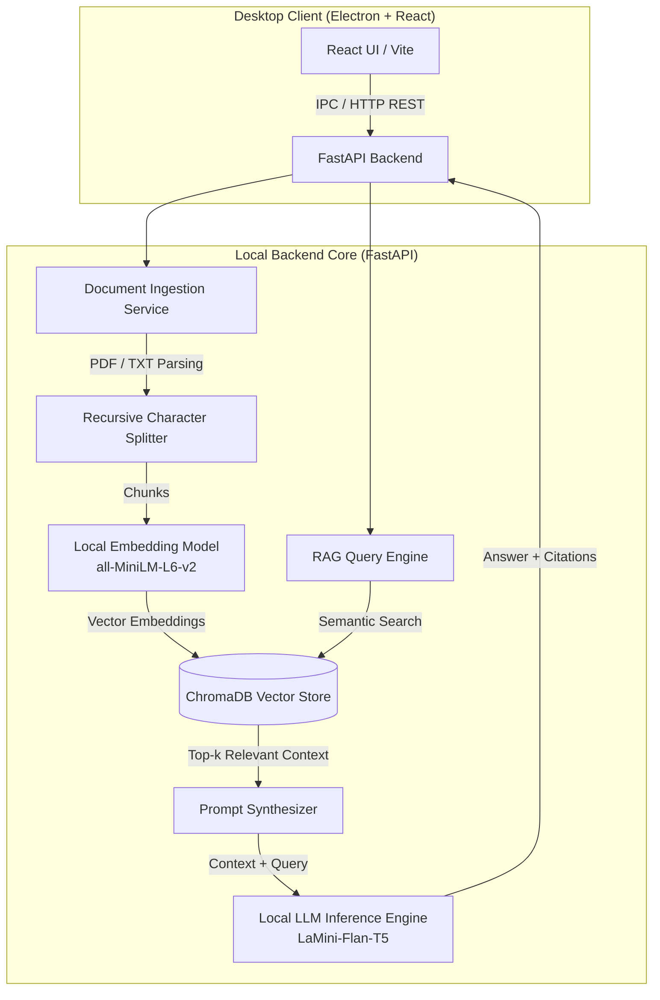

# 📄 Local AI Document Assistant

[](https://fastapi.tiangolo.com/)
[](https://reactjs.org/)
[](https://www.langchain.com/)
[](https://www.trychroma.com/)
[](https://www.electronjs.org/)
[](https://vitejs.dev/)

An offline, privacy-first desktop application for intelligent document analysis, semantic search, and Question Answering powered by an end-to-end local **Retrieval-Augmented Generation (RAG)** pipeline.

---

## 🌟 Highlights & Engineering Focus

- **🔒 100% Offline & Zero Data Leakage**: All document parsing, vector embeddings, and LLM text generation occur entirely on the local device. No external API calls or third-party cloud services are required.
- **🧠 Local RAG Pipeline**: Employs LangChain, `sentence-transformers/all-MiniLM-L6-v2` for dense embeddings, and ChromaDB as the persistent vector database.
- **📑 Citation-Backed Responses**: Generated answers cite their exact sources, including original document titles and page numbers for transparent verification.
- **🖥️ Standalone Desktop Executable**: Packaged with Electron and PyInstaller, bundling the FastAPI server and React interface into a unified, distributable desktop application.
- **🎨 Modern Interactive UI**: Built with React, Vite, Tailwind CSS, Framer Motion micro-animations, and Lucide icons.

---

## 🏗️ System Architecture



---

## 🛠️ Tech Stack

| Domain | Technology | Purpose |
| :--- | :--- | :--- |
| **Frontend** | React 18, Vite, Tailwind CSS | High-performance reactive user interface |
| **Animation & Icons** | Framer Motion, Lucide React | Polished UX and accessible visual cues |
| **Backend API** | FastAPI, Uvicorn, Pydantic | Asynchronous, typed REST API |
| **RAG & Orchestration** | LangChain, PyPDF | Document chunking, indexing, and retrieval QA chain |
| **Vector Store** | ChromaDB | Persistent local embedded vector database |
| **ML / Models** | HuggingFace Transformers, PyTorch | Local embeddings (`all-MiniLM-L6-v2`) & lightweight LLM |
| **Desktop Packaging** | Electron, PyInstaller | Cross-platform desktop runtime & binary compilation |

---

## 📁 Repository Structure

```text
ai-document-assistant/
├── backend/                  # FastAPI Application & AI Core
│   ├── core/
│   │   ├── config.py         # Application settings & environment parsing
│   │   ├── main.py           # FastAPI app instance and route registration
│   │   ├── routes/           # REST endpoints (health, upload, query, docs)
│   │   ├── schemas.py        # Pydantic request/response validation
│   │   ├── security.py       # Local session & authentication guardrails
│   │   └── services/
│   │       ├── model_service.py # Embedding and LLM loader
│   │       └── rag_service.py   # Ingestion, chunking, vector indexing, QA
│   ├── app.py                # Backend server entry point
│   ├── rag_backend.spec      # PyInstaller build specification
│   └── requirements.txt      # Python dependencies
│
├── frontend/                 # React Single Page Application
│   ├── src/
│   │   ├── components/       # Chat workspace, document list, settings modal
│   │   ├── App.jsx           # Main application state and layout
│   │   ├── config.js         # API endpoint and client configuration
│   │   └── index.css         # Tailwind directives & design system tokens
│   ├── package.json
│   └── vite.config.js
│
├── desktop/                  # Electron Desktop Shell
│   ├── main.js               # Main process managing backend child process & window
│   └── package.json
│
└── package.json              # Monorepo orchestration scripts
```

---

## 🚀 Getting Started

### Prerequisites
- **Python 3.10+**
- **Node.js 18+** & `npm`
- Git

---

### 1. Backend Setup

```powershell
# Navigate to backend directory
cd backend

# Create and activate virtual environment
python -m venv .venv
.\.venv\Scripts\activate   # On Windows (or 'source .venv/bin/activate' on Linux/macOS)

# Install dependencies
pip install -r requirements.txt

# Create local environment config
copy .env.example .env

# Run FastAPI server
python app.py
```
The backend will initialize and run at `http://127.0.0.1:5000`.

---

### 2. Frontend Setup

```powershell
# In a new terminal, navigate to frontend
cd frontend

# Install packages
npm install

# Create frontend environment config
copy .env.example .env

# Start development server
npm run dev
```
The React interface will be accessible at `http://localhost:3000` (or the port specified by Vite).

---

### 3. Running as an Electron Desktop App

```powershell
# From the root directory or desktop folder
cd desktop
npm install
npm start
```
Electron will launch a native desktop window and automatically handle backend communication.

---

## 📦 Building Standalone Executables

The project includes build pipelines to compile the entire system into standalone executables:

```powershell
# From the project root:

# 1. Build the frontend production bundle
npm run build:frontend

# 2. Package the Python backend into a standalone binary using PyInstaller
npm run build:backend

# 3. Package the complete Electron desktop app (.exe on Windows)
npm run dist
```
The distribution output will be generated in `desktop/dist/`.

---

## 💡 Key Engineering Decisions & Learnings

1. **Privacy-by-Design**: By hosting both the embedding model and the inference model on-device, sensitive files (contracts, research papers, personal notes) never leave the user's computer.
2. **Chunking Strategy**: Configured recursive character splitting with optimal token overlap (`chunk_size=500`, `chunk_overlap=50`) to balance granular semantic matches with sufficient context for synthesis.
3. **Resource Efficiency**: Selected lightweight, high-performance models (`all-MiniLM-L6-v2` and `LaMini-Flan-T5`) capable of running smoothly on standard consumer CPUs without requiring dedicated GPU clusters.
4. **Resilient Local IPC**: Designed the Electron desktop harness to spawn, health-check, and cleanly terminate the backend daemon process during application lifecycle events.

---

## 📄 License
This project is open-source under the MIT License.
